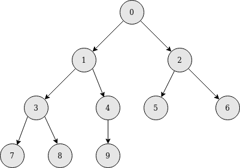
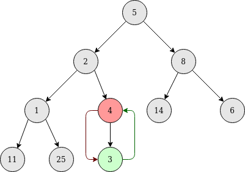
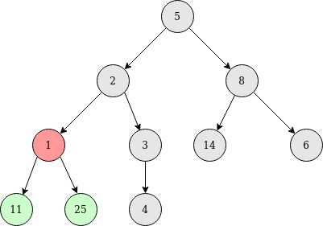
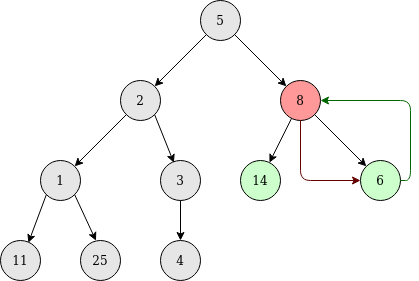
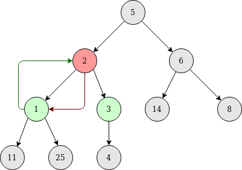
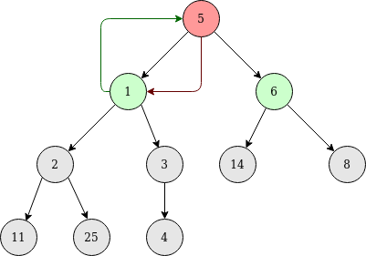
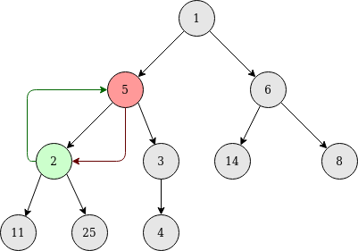

# Min Heap
Heap structure is a special case of a binary tree where the parent nodes are compared to their children with their values and are arranged accordingly. Heap structure was described in MIT lecture ["Heaps and Heap Sort"](https://www.youtube.com/watch?v=B7hVxCmfPtM) and in Medium article ["8 Common Data Structures every Programmer must know"](https://towardsdatascience.com/8-common-data-structures-every-programmer-must-know-171acf6a1a42). This repository contain implementation of Min Heap.

## Application
Heaps are used in heapsort algorithm to find n smallest or largest values in given array and create priority queues.

## Structure
The root of a tree contain the smallest value from iterable array. Every parent is smaller than his children. It is ensured by min_heapify() method. If node n has children, first is in node 2n+1 and second in node 2n+2. For example structure of 10 items array will be represented as below:
</br>
</br>

</br>
</br>
To get Min Heap below methods can be used:
- min_heap - iterate from the last parent to the root
- min_heapify - check if parent node is smaller than children nodes
- exchange - swap 2 values ​​with each other

## Example
To visualize Min Heap example iterable array can be used:
```python
iterable_array = [5, 2, 8, 1, 4, 14, 6, 11, 25, 3]
```
This array can be visualized as a tree:
</br>
</br>

</br>
</br>
For the last parent (node 4) function min_heapify is called. It calls exchange method because parent node is bigger than child node. After swapping min_heapify is fulfilled.
</br>
</br>

</br>
In the next step node 3 is processed and it has value smaller than his children so nothing changes.
</br>
</br>

</br>
</br>
Nodes 2 and 1 are processed similar to node 4.
</br>
</br>


</br>
</br>
Handling case of node 0 after exchange min_heapify rule isn't done so exchange method should be executed also for changed child.  After that min_heapify is fulfilled.
</br>
</br>


</br>
</br>
Final Min Heap tree form:
</br>
</br>

</br>
</br>
Array in Min Heap structure is equal to:
```python
[1, 2, 6, 5, 3, 14, 8, 11, 25, 4]
```
## Heapq library
Queue function which use heaps is implemented in [heapq](https://docs.python.org/3.0/library/heapq.html) library and method which use Min Heap structure to find n smallest items in iterable array is `nsmallest`.
